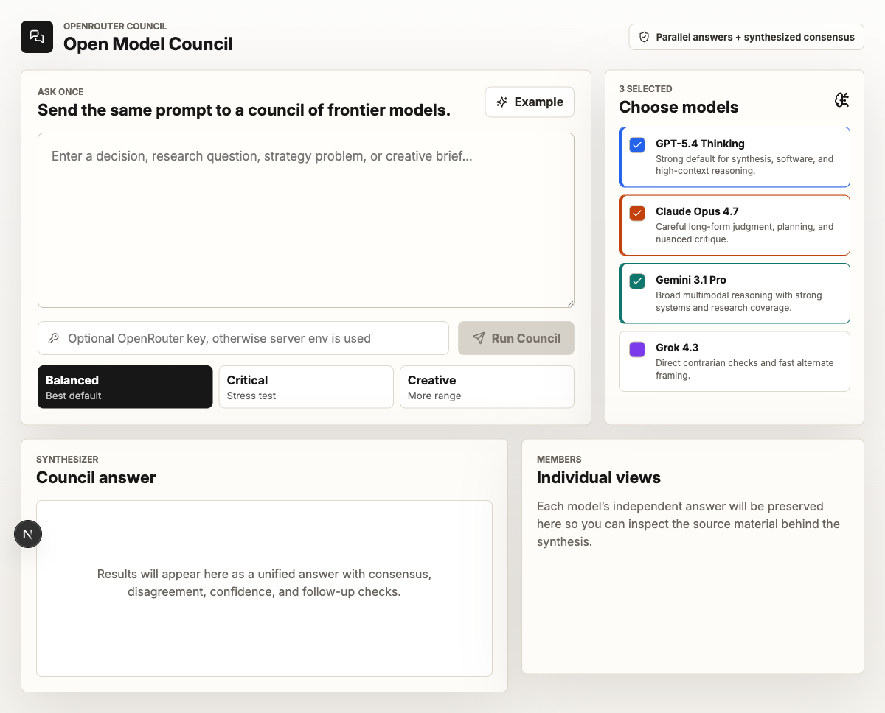

# Consenso IA — Model Council MAGI

> Spanish-language AI model council (draft → debate → synthesis) running mostly-free models via OpenRouter, direct NVIDIA NIM, and direct Google AI Studio, with a MAGI-inspired live status panel. Fork of [sanky369/open-model-council](https://github.com/sanky369/open-model-council).

Le hacés una pregunta a un panel de varios modelos de IA. Cada uno responde por separado, después se **critican entre sí** en una ronda de debate, un modelo juez extrae los consensos y desacuerdos reales, y finalmente un modelo sintetiza todo en una sola respuesta consensuada con el desglose completo de cada paso.



---

## Qué hace

1. **Borradores independientes.** 2 a 10 modelos responden la misma pregunta en paralelo, sin verse entre sí.
2. **Debate.** Cada modelo ve su propio borrador completo + versiones **condensadas** de los borradores de los demás (solo la respuesta directa, el razonamiento clave y la recomendación final — no la evidencia/asunciones/riesgos completos, para no reenviar el mismo contenido 5 veces en prompts gigantes), y produce una crítica + respuesta revisada.
3. **Juez de fusión.** Un modelo dedicado extrae consenso, contradicciones, insights únicos y vacíos de cobertura entre todos los debates, como datos estructurados. Si el proveedor falla, cae a un reporte heurístico local en vez de romper la corrida.
4. **Síntesis final.** Un modelo redacta la respuesta consolidada usando el reporte del juez + todos los borradores/debates — con secciones de conclusión, respuesta en profundidad, dónde coincidió/discrepó el consejo, insights únicos, confianza y preguntas abiertas, y próximos pasos recomendados.
5. **Preguntas de seguimiento** sugeridas automáticamente, y podés seguir la conversación en el mismo hilo.

Podés inspeccionar cada fase en la UI — borradores, críticas del debate, fuentes, y la respuesta individual de cada modelo — y hay una **vista Tribunal** alternativa (estética de terminal ámbar/rojo) para ver el veredicto final de forma más visual.

---

## Modelos y proveedores

El panel corre **primariamente con modelos gratuitos**. Podés sumar modelos de pago si tenés crédito cargado en OpenRouter (o querés usar tu propia key de NVIDIA/Google), pero nada de esto es obligatorio para que la app funcione.

| Proveedor | Cómo se llama | Requiere |
|---|---|---|
| **OpenRouter** | Modelos `:free` (Nemotron, GPT-OSS, Gemma, Laguna, North Mini Code) | `OPENROUTER_API_KEY` |
| **NVIDIA NIM** (directo) | Fallback automático para modelos Nemotron + 2 modelos nativos (Llama 3.1 8B, GLM-5.2) | `NVIDIA_API_KEY` (opcional) |
| **Google AI Studio** (directo) | 3 modelos Gemini nativos (3.7 Flash, 3.1 Pro Preview, 2.5 Flash-Lite) | `GEMINI_API_KEY` (opcional) |

**Por qué dos proveedores directos además de OpenRouter:** el pool gratuito de OpenRouter es compartido entre todos sus usuarios, así que los modelos más populares (`gpt-oss-20b`, `gemma-4`) se saturan seguido (HTTP 429). NVIDIA y Google ofrecen sus propios cupos gratuitos, separados de ese pool compartido — cuando configurás esas keys, el sistema los usa tanto como fallback (si OpenRouter falla con un modelo Nemotron, reintenta directo por NVIDIA antes de rendirse) como para dar acceso a modelos que no están disponibles gratis en OpenRouter en absoluto.

Todo el roster de modelos es configurable en `lib/models.ts` — agregar un modelo nuevo es agregar una entrada al array.

### Nota sobre Gemini 3.1 Pro

Confirmado en vivo: este modelo **no tiene cupo gratuito** en Google AI Studio — necesita un proyecto de Google Cloud con facturación habilitada. Flash y Flash-Lite sí tienen cupo gratuito real.

---

## Ingeniería de resiliencia

El pool gratuito compartido de OpenRouter, y en menor medida las APIs directas de NVIDIA/Google, tienen fallas transitorias frecuentes (rate-limiting, timeouts, respuestas vacías). El sistema está armado para absorber esto sin romper toda la corrida:

- **Timeout real por llamada** (7 minutos por defecto) que se mantiene armado durante toda la lectura de la respuesta, no solo hasta que llegan los headers.
- **Reintento con backoff** en 429 (respetando `retry_after_seconds` si el proveedor lo informa) y en errores de red genéricos (`fetch failed`, conexión caída).
- **Reintento en respuesta vacía**: modelos de razonamiento grandes a veces gastan todo su presupuesto de tokens "pensando" y nunca emiten contenido visible — se reintenta con más presupuesto y menor esfuerzo de razonamiento.
- **Watchdog por fase**: además del timeout por llamada HTTP, cada fase (juez, síntesis, follow-ups) tiene un techo firme independiente, para garantizar que la corrida nunca se cuelgue indefinidamente.
- **Fallback de modelo dinámico para la síntesis**: si el modelo principal falla del todo, se reintenta con un modelo garantizadamente distinto (nunca el mismo, aunque una variable de entorno lo fuerce).
- **Logging detallado por consola** en cada paso (inicio, fin, duración, error completo) — corré `npm run dev` y mirá la terminal para diagnosticar cualquier corrida.

---

## Agente de archivos (opcional)

Uno de los modelos del consejo puede actuar como **agente de archivos**, con herramientas para leer y proponer cambios sobre el proyecto donde corre el servidor:

- `list_directory`, `read_file` — se ejecutan al toque, sin aprobación.
- `propose_write_file`, `propose_edit_file` — nunca escriben directo a disco. Calculan un diff, lo dejan en espera, y **vos lo aprobás desde la UI** antes de que se aplique.

**Modelo de seguridad**: todo path se resuelve contra `AGENT_FS_ROOT` (por defecto, la carpeta del propio proyecto) y se rechaza si intenta salir de ahí, siguiendo symlinks incluido. Esto solo tiene sentido porque la app corre self-hosted — el servidor Next.js es un proceso Node normal con acceso real al sistema de archivos de tu máquina, sin sandbox aparte.

Se activa desde el conector "Filesystem" en Ajustes, eligiendo qué modelo del panel actual actúa como agente.

---

## Adjuntos

Podés subir imágenes, archivos de texto (`.txt`, `.md`, `.csv`, `.json`, código, `.html`, `.xml`, `.yaml`), y documentos **PDF/DOCX** — el texto se extrae server-side (`pdf-parse` y `mammoth`) antes de mandarlo al consejo. La extracción es best-effort: un archivo corrupto o escaneado sin OCR no rompe la corrida, devuelve un mensaje explicando por qué no se pudo leer.

---

## Vista Tribunal

Botón "Tribunal" junto a la respuesta sintetizada — muestra el mismo resultado con una estética alternativa de terminal (ámbar/rojo, tarjetas con esquinas cortadas), con el código de caso, el estado real (resuelto/en disputa según el juez de fusión), y el veredicto de cada modelo. Es una interpretación original, no usa ningún asset con derechos de autor.

---

## Panel MAGI

El estado del consejo (en espera, deliberando, completo) se muestra en un panel inspirado en la estética de terminal MAGI — triángulo con líneas conectoras cuando hay 3 modelos, disposición radial con 4-5, fila simple para el resto. Vive en `app/components/council/`, es autocontenido (sus estilos usan el prefijo `.magi*` y no tocan la paleta del resto de la app).

---

## Stack técnico

- **Framework:** Next.js 16 (App Router) + React 19
- **Lenguaje de la UI:** Español
- **Estilos:** CSS plano con sistema de variables (paleta cream/teal estilo Perplexity + panel MAGI independiente)
- **Markdown:** `react-markdown` + `remark-gfm`
- **Íconos:** `lucide-react`
- **Gateways de LLM:** [OpenRouter](https://openrouter.ai) (principal), [NVIDIA NIM](https://build.nvidia.com) y [Google AI Studio](https://aistudio.google.com) (directos)
- **Extracción de documentos:** `pdf-parse`, `mammoth`
- **Persistencia:** `localStorage` del navegador — sin base de datos

---

## Instalación rápida

### 1. Clonar e instalar

```bash
git clone https://github.com/enzoayala32/model-council-magi.git
cd model-council-magi
npm install
```

### 2. Configurar variables de entorno

```bash
cp .env.example .env
```

Como mínimo necesitás `OPENROUTER_API_KEY` ([conseguí una gratis acá](https://openrouter.ai/keys)). `NVIDIA_API_KEY` y `GEMINI_API_KEY` son opcionales — sin ellas, la app funciona igual solo con los modelos de OpenRouter.

### 3. Correr en desarrollo

```bash
npm run dev
```

Abrí [http://localhost:3000](http://localhost:3000).

### 4. Build de producción

```bash
npm run build
npm start
```

---

## Estructura del proyecto

```
app/
  page.tsx                        # UI completa
  layout.tsx                      # metadata, lang="es"
  globals.css                     # paleta cream/teal + estilos generales
  components/council/              # panel MAGI (autocontenido)
  api/council/route.ts             # variante no-streaming
  api/council/stream/route.ts      # orquesta las 4 fases, vía SSE
  api/council/apply-file-change/   # aprobación de cambios del agente de archivos
lib/
  models.ts                       # catálogo de modelos y paneles de fusión
  openrouter.ts                   # cliente OpenRouter
  nvidia.ts                       # cliente NVIDIA NIM directo
  google-ai-studio.ts             # cliente Google AI Studio directo
  llm-shared.ts                   # tipos y clase de error compartidos
  agent-tools.ts                  # herramientas de GitHub
  fs-tools.ts                     # herramientas del agente de archivos
  attachment-extraction.ts        # extracción de texto de PDF/DOCX
  skills.ts, threads.ts           # habilidades del agente e hilos guardados
```

---

## Créditos

Fork de [sanky369/open-model-council](https://github.com/sanky369/open-model-council), la implementación original del concepto "Model Council" estilo Perplexity. Esta versión suma: traducción completa al español, proveedores directos de NVIDIA/Google además de OpenRouter, ingeniería de resiliencia extensa (timeouts, reintentos, watchdogs), agente de archivos con aprobación, extracción de PDF/DOCX, y el panel MAGI.
